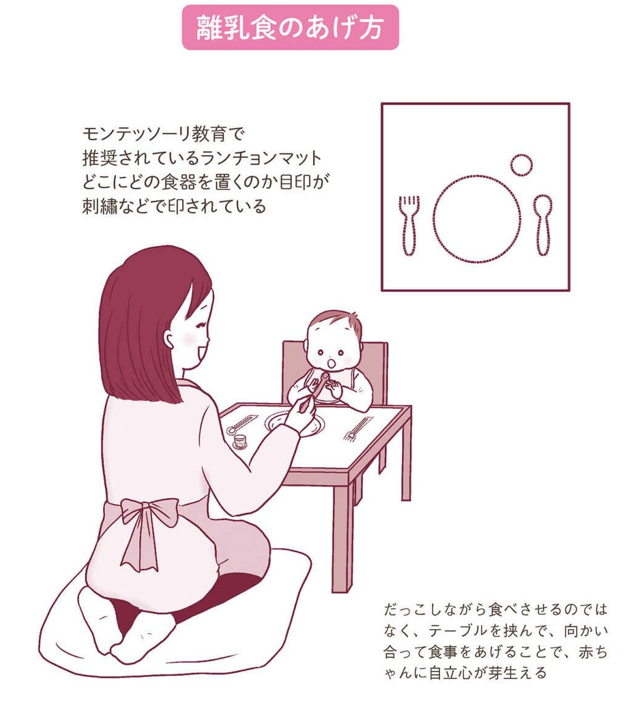

# ナビゲーションリンク
- [序章 はじめに知っておきたいこと](https://github.com/tamito0201/rento_parenting/blob/master/doc/20191007_Extend_future_talents_0_and_1_year_old_Montessori_parenting/20191007_Extend_future_talents_0_and_1_year_old_Montessori_parenting.md#%E5%BA%8F%E7%AB%A0-%E3%81%AF%E3%81%98%E3%82%81%E3%81%AB%E7%9F%A5%E3%81%A3%E3%81%A6%E3%81%8A%E3%81%8D%E3%81%9F%E3%81%84%E3%81%93%E3%81%A8)
- [第1章 赤ちゃんが生まれる前に](https://github.com/tamito0201/rento_parenting/blob/master/doc/20191007_Extend_future_talents_0_and_1_year_old_Montessori_parenting/20191007_Extend_future_talents_0_and_1_year_old_Montessori_parenting.md#%E7%AC%AC1%E7%AB%A0-%E8%B5%A4%E3%81%A1%E3%82%83%E3%82%93%E3%81%8C%E7%94%9F%E3%81%BE%E3%82%8C%E3%82%8B%E5%89%8D%E3%81%AB)
- [第2章 赤ちゃんが生まれたら-産後の生活の始め方-](https://github.com/tamito0201/rento_parenting/blob/master/doc/20191007_Extend_future_talents_0_and_1_year_old_Montessori_parenting/20191007_Extend_future_talents_0_and_1_year_old_Montessori_parenting.md#%E7%AC%AC2%E7%AB%A0-%E8%B5%A4%E3%81%A1%E3%82%83%E3%82%93%E3%81%8C%E7%94%9F%E3%81%BE%E3%82%8C%E3%81%9F%E3%82%89-%E7%94%A3%E5%BE%8C%E3%81%AE%E7%94%9F%E6%B4%BB%E3%81%AE%E5%A7%8B%E3%82%81%E6%96%B9-)
- [第3章 赤ちゃんの成長をサポートするポイント-0歳～5か月頃まで-](https://github.com/tamito0201/rento_parenting/blob/master/doc/20191007_Extend_future_talents_0_and_1_year_old_Montessori_parenting/20191007_Extend_future_talents_0_and_1_year_old_Montessori_parenting.md#%E7%AC%AC3%E7%AB%A0-%E8%B5%A4%E3%81%A1%E3%82%83%E3%82%93%E3%81%AE%E6%88%90%E9%95%B7%E3%82%92%E3%82%B5%E3%83%9D%E3%83%BC%E3%83%88%E3%81%99%E3%82%8B%E3%83%9D%E3%82%A4%E3%83%B3%E3%83%88-0%E6%AD%B35%E3%81%8B%E6%9C%88%E9%A0%83%E3%81%BE%E3%81%A7-)

# 未来の才能をのばす-０歳と１歳のモンテッソーリ子育て-
## 序章 はじめに知っておきたいこと
### モンテッソーリ教育による子育てのヒント
  1. 大人は、子どもが（赤ちゃん）が本来有能で、自分で自分を成長させる力を持っていると知る
  2. 赤ちゃんがその力を最大限に使えるよう、大人は必要なものを用意し、自分で選べる環境をつくる
  3. 小さくても一人の人間として経緯をもって接する。
  
- モンテッソーリの教育の基本
  - 「大人は子どもを①観察して②環境を整える」
    - （例1）つかまり立ちの頃には手をつきやすい棚を用意する。
    - （例2）ひとりで食べやすい小さなスプーンに変える
    
- 0歳から1歳のうちに育てておきたいこと
  - 自分を信じる気持ちと周りを信じる気持ち。

## 第1章 赤ちゃんが生まれる前に
### 1.1 4つのコーナー作り
- お部屋を「寝る」「授乳」「おむつ替えや着替え」「運動」のコーナーに分けて、赤ちゃんに「いつも同じ場所」で「いつもと同じ行動」をさせてあげる
  - ※生まれた直後から３歳ごろまでは、「秩序」にとても敏感だから。「秩序」とは「いつもと同じ」「いつもどおり」ということ。何も知らずに生まれてきた赤ちゃんは、この世界を理解するために、周囲の情報を猛スピードで吸収する。この情報を手がかりにして、「この世界はこういう所なんだ」と世の中を学んでいくが、入ってくる情報がコロコロ変わると、いつまでたっても、まわりの世界がわからず不安になる。だから、できるだけ「いつもと同じ」「いつもどおり」が赤ちゃんを安心させることが必要。
#### 1.1.1 「運動」のコーナー
- 起きている赤ちゃんが過ごすこの場所には、布団マットを敷くことが理想的。鏡を置けば、赤ちゃんは自分の身体の動きを写しており楽しむことができる。モビールをつるすなら、この場所に。
  - 鏡を置く理由としては、自分の姿や動きを見ることで自分の身体を徐々に認識し、身体感覚を向上するのに有効であると考えられている。
  - ポイントとして、この運動のスペースはなるべく家の中で同じ場所に限定すること。（今日はここ、明日はここと変えるのはおすすめしない）そうすることでベビーは「ここに来れば自由に遊ぶことができるんだ」と認識するようになり、この場所に愛着を感じ安心感を抱くようになる。
     - 3～5カ月の赤ちゃんにぴったりのおもちゃ・・・モビール、ガラガラ、ビーズ（にぎる用）
     
- ※モビール、ガラガラ： 0～5カ月の赤ちゃんにもおすすめのおもちゃは、モビールやガラガラ。ただし、赤ちゃんは興味あるものに自分から手を伸ばすようになるので、遊び方は変わっていく。「触る」「持つ」ということにフォーカスして、触り心地のいい素材、持ちやすい形状を考えて選ぶことが必要。
- ※ビーズ（にぎる用）： ガラガラをつかむのが難しい間は、それよりもつかみやすいものを選んでみること。糸に大きな丸いビーズを通したおもちゃは、比較的握りやすい。
#### 1.1.2 「寝る」のコーナー
- ここには、赤ちゃんの動きや視界をさえぎるベビーベッドではなく、低いマットレスや布団をおく。動き出したら自分で出入りできるようになる。小さな子やペットがいる場合などは、パーティションなどで区切って入って来られないようにするなどの工夫が必要。
  - 日本では、いわゆる柵のついたベビーベッドを使う場合が多いが、モンテッソーリは２～３ヶ月くらいまでならベビーバスケット、それ以降は布団や薄いマットレスを床に置いて睡眠の場所とすることを推奨している。ベビーベッドの柵は赤ちゃんの視界を遮ぎり、景色を分断してしまうから。囲いなどがあったとしても、寝た時に外が見えるくらいの高さにして、ベビーにはなるべくありのままの景色を見せることが望ましい。
  - 逆に寝る場所には、おもちゃのような刺激となるものは置かないほうが良い。
#### 1.1.3 「授乳」のコーナー
- 生後しばらくは、多くの時間をこの場所で過ごすことになるので、ママがリラックスできる椅子やお花を置いたり、赤ちゃんのタオルを置いておくとよい。
  - 代理の人があげる場合も、いつものこの場所であげることでベビーは安心して飲むことができる。
#### 1.1.4 「おむつ替えや着替え」のコーナー
- 赤ちゃんの服を着替えさせたり、おむつを帰るときは、同じ場所で行う。ティッシュ、おしりふき、おむつなどはここにまとめておく。
### 1.3 「トッポンチーノ」を用意する
- ママの胎内から外の世界に出てきたばかりの赤ちゃんにとって、安心感は、「この世界はよいところ」と感じるためにとても大切である。この世界を怖がらずにいられる子は、やがて、チャレンジを楽しめる子へと成長していく。したがって、赤ちゃんの安心感を守るために、モンテッソーリ教育では、新生児を[トッポンチーノ](https://hugkum.sho.jp/100667)という小さいお布団を使ってだっこすることをおすすめしている。
  - 首の据わっていない小さな新生児のだっこって、[トッポンチーノ](https://hugkum.sho.jp/100667)にのせると安定感が維持できるので、首の据わらない赤ちゃんのだっこも、運ぶのも、他の人に渡すのも、本当にラクになる。
     - できればママが妊娠中に布団の中に入れるなどして匂いをつけておくとよい。
### 1.4 産後、助けてくれる人を確保しておく
- モンテッソーリ教育とは直接関係はないが、「出産後に助けてくれる人を確保しておく」のは、出産前のママやパパにぜひやっておいてほしいことのひとつである。出産の大変さや、産後のママの心身の状態には大きな個人差があるが、核家族で暮らす人が多い今の日本では、ママが一人きりで育児をすることも多く、精神的にも肉体的にもクタクタになってしまうのは必然である。そうならないためにも、せめて産後の数ヵ月間は「誰かに頼れる状況」を確保できると理想的。
- もしものときにはプロにお願いも
  - 家族に頼るのが難しい場合は、産前・産後のママをサポートしてくれるプロの「[産後ドゥーラ](https://www.doulajapan.com/)」や、家事代行サービスなどに問い合わせて、サポートを得られるようにしておくと、とても安心。「母乳が出ない」「赤ちゃんが飲んでくれない」など、おっぱいの悩みも出てくるかもしれませんので、授乳の相談ができる近隣の助産師さんなどを調べたり、妊娠中に助産師さんにおっぱいの状態を見ておいてもらうことも、とても大きな助けになる。
### 1.5 「心の二本の足」を育てよう!
- 0歳と1歳の育児の以下のテーマは、モンテッソーリ教育では「心理的な二本の足」と呼ばれている。
  - ①「この世界はいいところだな」と安心してまわりを信頼する気持ち
    - 「まわりを信頼する気持ち」が育つと、チャレンジを楽しめる子に育つ。
  - ②「自分は何でもできる有能な存在なんだ」と自分を信頼する気持ち
    - 「自分を信頼する気持ち」が育つと、困難にぶつかってもめげずに前進を続けられる子に成長する。
- よって、そのために大人がすべきなのが、まずは赤ちゃんにこの世界をいいところだと思ってもらえるように「安心感」が得られる環境をつくること。
### 1.6 Summary
- 居心地のよかったママのおなかから急に外に出てきた赤ちゃんは、最初は不安だが、「この世界は安心できる場所なんだ」と感じることで、まわりの人たちを信頼できるようになる。
- 成長と共に、「あ、ここに来るとおっぱいがもらえる！」「ここにきたら寝るんだな～」という風にベビーも分かってくるので、ママにとってもお世話がしやすくなる。
## 第2章 赤ちゃんが生まれたら-産後の生活の始め方-
### 2.1 赤ちゃんの発達やママとの絆を育む特別な期間の過ごし方
- モンテッソーリ教育では、生後６〜８週間ごろまでを「母子共生期」と言う。この期間は、以下の理由から、赤ちゃんとママができるだけ密着して過ごすことが大切である。
  - 新たな関係性へのスモールステップ
     - 妊娠中、赤ちゃんとママはずっと一体だったが、出産後、二人は突然別々の存在になる。このとき、急激な環境の変化に、お互いにショックを受けやすくなる。そのショックをやわらげる助けとなるのが、**生まれてから約２ヵ月間の共生期を「できるだけ密着して過ごすこと」。**
     - このぴったんこの期間が、赤ちゃんとママが「一体」→「別々の存在」という新しい関係性を受け入れるための、スモールステップとなる。
  - ママと赤ちゃんの絆を深める
     - 共生期は、ママと赤ちゃんとの絆を深めていく大事な時期でもある。ここで築いたママとの関係が、赤ちゃんの「最初の人間関係」となる。**ママのだっこや授乳を通じて、赤ちゃんは人との信頼関係やつながりを学んでいく。**
  - 新生児の脳の発達をたすける
     - **新生児の触覚はとても鋭く、触覚を刺激することは、脳の発達を促すことにつながる。そのため、ママと肌と肌で触れ合う機会をできるだけ多くもつことは、赤ちゃんの脳の発達にもよい。**
   - 赤ちゃんの「外の世界への信頼感」を高める
      - 共生期をぴったんこで過ごすと、ママは赤ちゃんの求めに気づきやすく、すぐに応じられる機会が増える。求めるとすぐに反応してもらえる機会が多い赤ちゃんは、「居心地のよかった胎内とはまた違うけど、この新しい世界もいいところなんだ！」と外の世界に対する信頼感を持つようになる。
      - こうしたことから、**この時期の来客などはできるだけ控えてもらい、赤ちゃんとママがなるべく二人だけでゆっくり過ごすことが大切**である。そんな環境をつくるために、パパや他の家族が、できるだけ赤ちゃんとママを守ってあげることが必要である。
### 2.2 母乳育児のススメ
生後すぐからはじまる赤ちゃんとママとの大事な関わりが、授乳。モンテッソーリ教育では、以下のメリットがあることから、可能なら母乳育児をおすすめしている。
#### 2.2.1 母乳のメリット
- 乳首を吸われる刺激により、ママの子宮の回復を助ける
- **赤ちゃんがあごや顔の筋肉をたくさん使って飲むため、骨・歯・筋肉がよく発達する授乳によりママのホルモンバランスが変わり、赤ちゃんとの絆が深まる**
- 人間の赤ちゃんに最適な栄養素が多く含まれている
- 飲みはじめからおわりまで、おっぱいの味が変化していくため、赤ちゃんはフルコースを食べるように母乳を楽しめる
- **哺乳瓶とちがって、自分で吸いついて、自分から乳首を離すことができるので、赤ちゃんの意志が育つ**
#### 2.2.2 飲む予防接種「初乳」
- 出産後数日の間に出るコッテリした「初乳」は、さまざまな免疫物質が、通常の母乳よりずっと多く含まれているといわれる特別なもの。
- 初乳は、赤ちゃんの胎便を出すのを促してくれるうえに、**脳の発達に重要な「タウリン」なども含んでいます**。ですから、ぜひとも赤ちゃんに飲ませてあげる。
- もし赤ちゃんがうまく初乳を吸えないようなら、小さなスプーンなどにすくって、飲ませてあげてもよい
### 2.3 赤ちゃんの気持ちを大切にする授乳
赤ちゃんを観察し、赤ちゃんのリードに合わせて飲みたがるときにあげる。**授乳は単なる栄養補給ではなくて、赤ちゃんとママが触れあうことで、人間関係の基礎を育む大事な大事な時間**である。
#### 2.3.1 モンテッソーリ式授乳とは
- モンテッソーリは、赤ちゃんは環境さえ整えばひとりでなんでもできるとても賢い人だと考えていた。
- そのため、授乳をするときも、赤ちゃんがまったく母乳やミルクを飲まないなど、医学的に見て問題がある場合以外は、何よりもまず、赤ちゃんの意志を尊重する。そうすることで、**「自分で何でも決められる、有能な存在だ」という気持ちが赤ちゃんの中に育まれる。**
#### 2.3.2 「自由な時間割（フリータイムテーブル）」
- 大人が時間を決めず、赤ちゃんから欲しいという合図があったらおっぱいをあげるという意味。日本では、「自律授乳」と呼ばれるものに近い。「自由な時間割」には、次のようなポイントがある。
  - 赤ちゃんをよく観察して、お腹をすかせていそうなときに授乳する
  - **赤ちゃんにその気がないのに、乳首を無理やり口の中に押し込まない**
  - **赤ちゃんが寝ているところを無理やり起こさない**
  - **授乳中は、赤ちゃんが自分で乳首から離れるのを待つ**
  - 飲んでいるのをさえぎってまで両乳房から均等に飲ませようとせず、片方ずつ授乳する
- **大切なのは、「ママが赤ちゃんを観察すること」と「赤ちゃんが主導する」こと。**
- **授乳は赤ちゃん主導が望ましく、無理やり飲ませることはしないほうがよい。**
- 最近では赤ちゃんが飲みたがる様子をみせず、なかなかおっぱいに吸いついてくれないケースも多い。そのときは、**安易に哺乳瓶を使用せずに、初乳をしぼり、スプーンで少しすくって口の中に入れてあげるなどして、赤ちゃんの「飲みたい！」という意欲がわいてくるのを待つ。**
#### 2.3.3 哺乳瓶を使うときは
- **一度哺乳瓶を使ってしまうと、赤ちゃんがあまりにも楽に飲めるために、母乳による授乳が難しくなる場合が多い。**
- 哺乳瓶を使う必要がある方は、母乳をあげるようなだっこの姿勢で、赤ちゃんとの一体感を味わいながら授乳をする。ママとぴったんこの一体感が味わえることで、赤ちゃんも安心するのある。
- **哺乳瓶の場合は、瓶の中のミルクがなくなると終わってしまうが、その後も、しばらくはだっこの姿勢で、肌と肌を触れ合わせて、スキンシップを楽しむ**
#### 2.3.4 「４つのコーナー」での過ごし方
「いつもと同じ」で、赤ちゃんが安心して過ごせるようにしてあげる。もちろん「『寝る』コーナー以外では寝かせない」「『授乳』のコーナー以外ではおっぱいをあげない」など、「その場所以外では行わない」というのは難しいと思いますので、「できるだけ」を心がけてみる。そうすることで、**秩序に敏感な赤ちゃんは少しずつ安心できるようになる**。
##### 2.3.4.1 「寝る」コーナー
- 子どもが主体のモンテッソーリ教育では、 **子どもが何でも「自分の考えで、ひとりでできるようにすること」** を目指している。
- そうした点から、赤ちゃんに理想的なベッドとはズバリ、**低いマットレスや布団**である。
- 大人側の利便性としてはベビーベッドを選びたいところだが、**高さや柵のあるベビーベッドは視界を妨げ、赤ちゃんが自分で出入りすることもできない。**
- 赤ちゃんに自分で動く自由があり、眠くなったら自分で入れる低いマットレスや布団が、**意志や運動能力を発達させる上でもとても理想的である。**
- 赤ちゃんが他の場所で寝たり、うとうとし始めたりしたときは、できるだけ**この寝るコーナーに連れてくるようにする**。「いつも同じ場所」で眠ることで、赤ちゃんは少しずつ落ち着いてきます。
##### 2.3.4.2 「授乳」コーナー
- 赤ちゃんとママは、多くの時間をこの場所で過ごすことになるので、ママがリラックスできる場所づくりが大切
- ママの座りやすいイスなどを用意して、そばにママの水分補給用の飲み物や、赤ちゃんのよだれ拭きなども、あらかじめセットしておきましょう。ママを癒すお花やオルゴールなどを置くのもよい。
- **授乳のときに、ついついスマホやテレビを見たくなることもあると思うが、必ず我慢してみない。** 授乳は、ママと赤ちゃんの人間関係の基礎をはぐくむ大切な時間。絆を深めるためにも、目の前にいる赤ちゃんとの一対一の時間を感じながら過ごす必要がある。
- ５ヵ月ごろになって離乳食をスタートさせるときは、ここに離乳食用の小さな机とイスを用意して、授乳前にほんの数口だけ「食べる」経験をつむのも、スモールステップとしておすすめである。
##### 2.3.4.3 「運動」コーナー
- 赤ちゃんの目が覚めているときは、ここに連れてくる。モビールを吊るすなら、ここにします。すると、**赤ちゃんが目の焦点を合わせる練習をしたり、手を伸ばすなどして、運動機能の調整を始める。**
- 低い棚（できれば一段のもの）を置いて、何個かおもちゃ（ガラガラやボールなど）や絵本を置いておくようにすると、**そのうち自分からずりばいなどで取りに行くことができる。**
- 低い棚をおすすめする理由は、いつかつかまり立ちをするときに、赤ちゃんが手をつく高さにぴったりだから。
##### 2.3.4.4 「おむつ替えや着替え」コーナー
- おむつ替えや着替えなども、いつも決まった場所で行うとよい
- 毎回同じ場所で、同じ流れでおむつ替えや着替えを行うことで、赤ちゃんのほうもだんだんと「今からおむつ替えをするんだな」などと予測ができるようになり、**少しずつ落ち着くようになる。**
- 赤ちゃんに「これからおむつを替えるよ」「お尻をふいたから、気持ちいいね」「足をきれいきれいしたよ」などと声をかけると、ことばがわからない乳児でも、これから何をされるのか予測できるようになり、安心感が増していく。
- また、触られたときに身体のパーツの名前を聞くことで、その名を覚えることができる。
#### 2.3.5 上手なねんねへの導き方
- 「いつもと同じ」を利用して入眠のタイミングを覚えてもらう。
- **赤ちゃんのねんねにも、生まれたときから６歳ごろまで続く「秩序感」＝「いつもと同じが安心」という感覚を、うまく使うことができる**
- 「入眠儀式」ということばがある。寝る前に習慣とする行動のこと。たとえば大人でも、読書、入浴、音楽などの決まった儀式によって、眠りに入りやすくなる。この入眠儀式も、私たちが秩序感を使って、「これをしたら眠る合図」ということを、脳や身体に覚えさせているといえる。
- 大人も子どもも、睡眠のために心がけたいポイントは、次の６つです。
  - 夜寝る前には、部屋を暗く静かに
  - 夜中に起きても明るい電気をつけず、しばらく様子を見る
  - 朝は決まった時間にカーテンを開けて、日の光を入れる
  - 日中はできるだけ、午前中に太陽の光をあび、身体を動かす
  - 夜の入眠儀式をつくる
    - **「寝る」コーナーで「いつもと同じ」行動を取ることで、赤ちゃんに入眠の儀式を覚えてもらう。たとえば、決まった時間に部屋を暗くしてママやパパがお歌を聞かせる、絵本を読んであげる、眠くなるまでやさしく赤ちゃんの肌をなでるなど。ただし、「だっこでゆらゆら」や「おっぱいをくわえたまま眠る」ことが入眠儀式として習慣化してしまうと、それがないと寝られなくなってしまうことがあるため注意が必要。**
  - 「寝る場所」に、刺激になるものを置かない
    - 寝る場所には、おもちゃやモビールなど、赤ちゃんの刺激になるものは置かないようにする。
#### 2.3.6 お昼寝の時間に注意する
- 余裕があれば、**赤ちゃんの睡眠のパターンを知るために、睡眠表をつけてみることもおすすめ。**
- 夜泣き専門保育士として活躍されている清水悦子さんは、**生後２〜３ヵ月ごろから、お昼寝は昼過ぎから午後にかけて大体２〜３時間ぐらいにとどめ、７〜８ヵ月以降は夕方はなるべく起きていられるようにすることを推奨している。**
- **赤ちゃんとっても、一日の生活リズムを整えることは大事なこと！ ０歳の赤ちゃんだからといって、夕方まで寝たいだけ寝かせておいては、いつまでたっても、睡眠のリズムが整わないことの原因となる。**
    - <h1>お昼根時間の目安</h1>
  
### 2.3.7 パパの大切な役割
#### 2.3.7.1 「母子共生期」を守るバリア
- 赤ちゃんのいる生活が楽しくなるかどうか、パパの腕の見せどころ。パパにも大切な役割があります。育児にいそしむママのサポート
- 「母子共生期」を守るバリアになる
    - 後６〜８週間までの赤ちゃんは、ママとぴったんこで過ごすことで、人との関係性を学ぶとても大切な「母子共生期」にいます。このとき、赤ちゃんとママができるだけ二人でゆっくり過ごせるよう、パパは共生期を守るバリアになってあげる
    - いい新生児をだっこしに、親戚が押しかけて来たがるかもしれませんが、生後８週間ごろまでは、できるだけ来客は断りましょう。
    - パパが家事をしたり、上の子がいる場合は積極的に遊んであげたりするのも大切
    - 仕事などで自分ができないときには、ばあばやじいじ、シッターさんなど、代わりにバリアとなってくれる人を確保することも重要。
#### 2.3.7.2 赤ちゃんのお世話で専門の役割をもつ
- パパは赤ちゃんの「沐浴」や「おむつ替え」など、授乳以外でできる専門の役割をもつことができる。
    - 離乳食がはじまったら、赤ちゃんに食べさせる役割を担当するのもいい
- ママのメンタルケア
    - パパたちにぜひお伝えしたいことがある。もしかすると、妊娠中や０歳児の育児をする中で、奥様にひどいことを言われることもあるかもしれない。それを、どうか直球で受けとめすぎないようにする。
    - 妊娠中や出産後は、慣れない生活による疲労やホルモンバランスの乱れにより、攻撃的になったり感情的になったりするママもいる。でも、これはママが赤ちゃんとの新しい生活を営むために、必死にがんばっている証拠。パパがそのことを理解して、ママを気づかってくれたら、ママの気持ちはずっとラクになる。
    ― また、妊娠中の女性は、自分の足が見えないくらいお腹がせり出すなど、身体が大きく変化する。産後も、それまでのように自分のことに時間がとれず「自分には女性としての魅力がなくなったのではないか」と不安になっている方も少なくない。
    - 私がモンテッソーリ教育をアメリカで学んだとき、「この時期のパパはママに対して『世界で一番君は美しい』という必要がある」と聞いた。
    - 照れくさいことばは言えなくても、以前とはちょっと違う奥様をやさしく受け止めてあげることが、パパにできる大切な役割のひとつ
### 2.3.8 ママが気をつけたいこと
#### 2.3.8.1 パパのやり方を認めてあげる
- パパはたいてい、ママよりもダイナミックに子どもと関わります。そんなパパのやることなすことに、ママはハラハラ・イライラすることもあるかもしれない。
- でも、パパのやり方を認めてあげることも、パパのやる気をくじかないために大事なこと。あまり細かいことに口を出さないように心がける。
- **実際のところ、ダイナミックなパパの関わりは、子どもの世界を広げてくれることもあって、ママが思ってもみなかったような子どもの成長につながることも多い**
### 2.3.8 育児でこれだけは押さえておきたいこと
次の5つだけ、頭にいれておく
- **①運動をさまたげない**
- **②五感を使わせる**
- **③たくさんやさしく触れる**
- **④たくさん話しかける**
- **⑤できるだけ、いつもと同じを心がける**

    - この時期に、手や体を思い通りに動かせるだけ動かせたこと。
    - 豊かに「見る、聴く、触れる、味わう、嗅ぐ」を体験できたこと。
    - たくさん触れられ、たくさんやさしく抱いてもらったこと。
    - たくさん笑顔で話しかけてもらえ、聞いてもらえたこと。
    - だいたいいつも一定のリズムで、安心して生活ができたこと。
- **大人がこの5つを心がけるだけで、生涯続く子どもの自信とまわりの世界への信頼が育つ**  
## 第3章 赤ちゃんの成長をサポートするポイント-0歳～5か月頃まで-
### 3.1 赤ちゃんに生まれつき備わっている「子育ち力」を知っておく
- **ひとつ覚えておいてほしいのが、モンテッソーリ教育の子育ての主役は「大人」ではなく、あくまで「子ども」だということ。**
- **「子どもには生まれつき、自分で自分を教育できる力が備わっている」というのが、たくさんの子どもを観察したモンテッソーリの大発見だから**
- モンテッソーリが発見した、いわば「子育ち力」とも言える、赤ちゃんのすばらしい能力
    - **吸収する心**
    - **敏感期**
    - **人間の傾向性**
### 3.1.1 吸収する心
- 乳幼児だけが持つ、スーパー適応力！
    - 環境に適応できるように、人間の赤ちゃんは特別な働きをする脳をもっている。
    - 赤ちゃんが特にがんばらなくても、文化や言語を身につけられるのは、幼児期の特別な脳のおかげ。０〜６歳児だけがもつこの能力のことを、モンテッソーリは「吸収する心」と呼んだ。
    - 吸収する心をもつ子どもは、まわりの環境を、カメラで写し撮るように、そっくり吸収する。
    - おかげで、子どもは苦労せずに周囲の文化を身につけられるのです。**この時期に吸収したことは、子どもの柔らかな脳に深く刻み込まれ、一生を通じてその人のベースとなります。順応性が高い時期だからこそ、大人は「環境づくり」に気を配る必要がある。**
### 3.1.2 敏感期
- **敏感期とは、生きるために必要な能力がラクに身につく、子どもだけに現れる一時期のこと。その時期が過ぎると消えてしまって二度と現れない、とても特別な期間のこと。**
- **敏感期の子どもは、興味をもったことへの感受性が高まり、集中して同じ動作をくり返します。夢中でくり返すことで、自分の思い通りに体やことばを操れるようになる。**
- 特に０〜１歳ごろは、次の４つの敏感期が同時に現れる特別な時期。大人はこのことを知り、自分で成長しようとする子どもの邪魔をせず見守りることが必要。
    - ０〜１歳ごろに現れる敏感期
      - **「感覚」の敏感期…五感を使って見たい、聞きたい、触りたい、味わいたい、嗅ぎたい**
      - **「運動」の敏感期…頭から足先までのありとあらゆる動きを獲得したい**
      - **「秩序」の敏感期…「いつもと同じ」を手がかりにして、世の中を理解して安心したい**
 ### 3.1.3 人間の傾向性
 - 「人間の傾向性」とは、人間ならではの普遍的な知的好奇心のこと。
 - 私たち人間は、赤ちゃんから老人まで、次のような傾向性を持っている。
    - 周囲にあるものを知るために探索したい！
    - 自分がどこにいるか知りたい！
    - 「いつもどおり」がいい！
    - コミュニケーションしたい！
    - 仕事（作業・活動）したい！
 - たとえば、**赤ちゃんがハイハイするのは「周囲を探索したい」という傾向性からくる行動。**
 - 赤ちゃんの意味不明な行動も、傾向性を理解したうえで眺めると、「赤ちゃんは今、人として成長するために、こんなことを学びたがっているんだ！」とわかることがある。
### 3.2 0歳と1歳のモンテッソーリ教育とは?
- モンテッソーリは、子どもの発達段階に応じて、成長を「0歳〜6歳（幼児期）」「6歳〜12歳（児童期）」「12歳〜18歳 （思春期）」「18歳〜24歳（青年期）」の4つの段階にわけている。
- **中でも、0歳〜1歳は人間の根っこをつくるとても大事な時期で、この時期の学び方は、その後の段階とは大きく違う。**
- ところで、モンテッソーリ教育というと、教具を使ってお勉強をするイメージをもたれる方もいると思いますが、そのイメージはたいてい、モンテッソーリの実践園や小学校での教えが、教具を使って行われることからきているのではないか。
    - では、まだ教具が使えない0歳〜1歳の赤ちゃんができるモンテッソーリ教育とは、どんなものか。それは、
      - **手や体を運動させること**
      - **思うぞんぶん、感覚を使うこと**
      - **話しことばを聞いたり、音やことばを発したり、音楽を聞くことなど**
- こうして見ると、歩けるようになる前にできることは少ないように思えますが、赤ちゃんがモビールをじっと目で追ったり、安全な物をなめたり、ガラガラをにぎって音を聞いていたら、それも立派な学び。また「誰かがやっているのを見る」ことも、とても大事な経験である。
- **ですから、0歳〜1歳の赤ちゃんをベビーサークルなどに入れっぱなしにするよりも、背中におんぶをして、家事をする姿をみせてあげること。それが「日常生活の練習」の基礎になる。**
- **ちなみに0歳〜3歳のモンテッソーリ教育の核となるのが「日常生活の練習」。これは、自分自身のお世話やお手伝いを通じて、思い通りに動く手や体を手に入れていく活動のこと。たとえば、すわれるようになったら小さなミトンで机を拭く、歩けるくらいになったら自分で着替えたり、手を洗ったりする……など**
- **また、歩けるようになると、できることがグン!と増えていきますので、お手伝いの難易度を下げてどんどんやらせてあげましょう。子どもはそこから「自分が何かをして、誰かに感謝される存在なんだ」という喜びを得ていく。**
### 3.3 モビールを吊るして「視覚」と「好奇心」を育てる
#### 3.3.1 赤ちゃんだって、学びたい！ゆっくり動くモビールで、「見る練習」を促す
- **モンテッソーリ教育では、子どもはみんな自然からの宿題……つまり「子どものうちにこれだけはやれるようにしておいてね」という、生まれながらの宿題をもらっていると考える。**
- **宿題の内容は、生きていくために、さまざまなことが「ひとりでできるようになる」こと。つまり、自分の思い通りに動く体や、コミュニケーション能力を手に入れておくこと。**
- 赤ちゃんの見る力を育てるモビール
    - **０〜３ヵ月ごろのねんねの時期の赤ちゃんにぴったりなのが、上から吊るすモビール**。モビールとは、さまざまな素材を糸などで吊るし、バランスを保ちながら微妙に動くようにしたもの。
    - よいモビールは部屋の少しの空気の流れでも回転し、動き続けます。そのやさしい動きは、生まれたばかりの赤ちゃんのゆっくりとした目の動きにもぴったり。
    - **動くものを目で追って、焦点をあわせる練習をしながら、赤ちゃんは「見る練習」をします。早すぎる動きをするものには焦点を合わせられないので、赤ちゃんの目の動きにぴったりのゆったり回転するモビールを飾ってあげることで、赤ちゃんの視覚の発達を促したり、好奇心を刺激したりすることができる。**   
- 赤ちゃんのモビール選びのポイント
    - 生まれたばかりの赤ちゃんは視力が弱いため、次のようなものが見やすいといわれている。 
      - **白と黒などコントラストのはっきりしたもの**
      - **気の動きで、ゆらゆらとやさしい動きをするもの**
    - <h1>お昼根時間の目安</h1>
  
#### 3.3.2 吊るすものを変えて、運動能力の発達をたすける
- 触れたくて思わず手をのばすことで赤ちゃんの意志が育つ。赤ちゃんは興味あるものに手を伸ばす。
    - **生まれて３ヵ月くらい経つと、赤ちゃんは興味のあるものに向かって、自分から手を伸ばし始める。**
    - **こうなったら、「見るモビール」を、「触ったり、ひっぱったりできるもの」に変えるタイミング。なぜなら、赤ちゃんが気になるものに手を伸ばすのは、自分で思いどおりに動くための練習が始まった証拠。だから、思うぞんぶん、触れさせてあげる。**
- そもそも、生まれたばかりの赤ちゃんは、自分の意志で動かす筋肉（随意筋）を、上手に動かすことができない。 でも、自分の思ったとおりに動けるようになりたくて、このころから筋肉を動かす練習をはじめる。
    - 目の前のモビールになんとなく手を伸ばしますが、それが自分で動かせることを知ると、赤ちゃんは大興奮する。**これまではママやパパにお世話されるだけの受け身の状態でしたが、自分が動くことでまわりのものを動かせることに気づいて楽しくなるから**
- **この時期に大人が、ありとあらゆる動きを練習できる環境を用意すると、赤ちゃんに「あれを触ってみたい」という好奇心や、「楽しいからまた触るんだ！」という意志が育つ。**
- 生後３ヵ月ごろの赤ちゃんのオモチャを選ぶポイント
    - **触ったり舐めたりしても安全で壊れないもの**
    - **手触りのやさしいもの** ＊プラスチック、木、布などさまざまな素材があると望ましい
    - **音の出るおもちゃなら）やさしい音がなるもの**
    - **にぎるものは、赤ちゃんがにぎりやすいサイズのもの**
- **この時期の赤ちゃんは、見て、触って、音を聞いて、においを嗅いで、舐めて、全ての感覚をフルに使っておもちゃを楽しむ。**
  
  
#### 3.3.3 手と脳の発達をたすけるおもちゃ選び
- **月齢にあわせたおもちゃで手を動かしながら、脳を育てる。手は「飛び出た脳」。**
- 赤ちゃんが吊るされたおもちゃに手を伸ばすようになったら、その「小さなおてて」の成長にも目を向ける。最初は握ることもできなかったのに、少しずつ、いろいろなことができるようになってくる。
- **手は「飛び出た脳」と言われるくらい、手と脳には強いつながりがあって、実際子どもが手をよく使うことで、脳がどんどん発達していく。**
    - そのため、モンテッソーリ教育では、子どもの「手の発達」をとても大切に考えている。
    - **赤ちゃんが「思いどおりに動く手」を手に入れることは、その子がやがて「自分の行動の主人公」になっていくための大きな自信につながる。**
    - **ですから、手、さらに五感を使って、くり返し遊ぶことができるおもちゃは、この時期の赤ちゃんにとってとても大切なものになる。**
- ０〜１歳で育てておきたい手の力は、大きく分けると次の３つの力に分けられる。
    - **興味をもったものに手を伸ばす力**
    - **にぎる、つかむ、つまむ力**
    - **ものを思ったところで離す力**
- 赤ちゃんの手の発達具合に合わせて、こうした指の動きを練習できるおもちゃを、大人が用意してあげるとよい。
  
### 3.4  自信が育つ、ことばがけ
生まれたばかりの赤ちゃんは、まだじょうずに話せなくても、その柔らかな脳であらゆることばや状況を吸収していく。そのことを意識して、たくさんお話ししてあげる。
#### 3.4.1 ちゃんの「聞く力」「話したい気持ち」を育てる
- **０〜３歳は「話しことばの敏感期」と言われている。特に、脳の聴覚をになう場所がいちじるしく発達する０歳の１年間は、どんな言語でも身につけられるように、あらゆる音を聞き分けることができると言われている。**
- まだ話せない赤ちゃんも、耳で聞き、大人の口元をじっと見て、話しことばを吸収している。
- **そんな赤ちゃんが話せるようになるには、たくさんのことばを体験できる「豊かな言語環境」が重要**
- **豊かな言語環境とは、テレビやＣＤ教材ではなく、「まわりの人間」のこと。一日の中で意識して、音のない静かな環境で子どもと対話する時間をつくれるようにする。**
#### 3.4.2 聞いてもらえること」が、自信につながる
- **大人はただ話しかけるだけでなく、赤ちゃんが何か音を発しているときに、反応したり聞いてあげたりする態度をとることが大切**
- **なぜなら、大人がちょっと手を止めて、真剣に話を聞いて、反応してくれること。それは子どもにとって、話したい気持ちを育てるだけでなく、「自分はちゃんと尊重されて意見を聞いてもらえる存在なんだ！」という生涯にわたる自信にもつながる。**
#### 3.4.3 ママやパパの話し方のポイント
- **できるだけきれいで、正しいことばづかい**
- **ゆっくり話す**
- **目を見て直接話しかける**
- **口元をよく見せる**
#### 3.4.4 ママやパパの反応のし方のポイント
- **赤ちゃんの発した音をそのまま返してみる**
- **赤ちゃんの喃語に、大人は内容を想像して答える**
- 赤ちゃん「あーあー」 → 大人「そうだねー、面白いねー」
- 赤ちゃん「うーうー」 → 大人「ほんとだねー、雲が動いているね」など
- **直接間違いを訂正しない**
    - ねこに対して）「わんわん！」
    - ×大人「違うでしょ、これはねこでしょ！」
    - ねこに対して）「わんわん！」
    - ○大人「そうね、ねこだね、ネ、コ。ねこがいるね」
#### 3.4.5 赤ちゃん実況中継をしてみ
- 大人がアナウンサーのように動きを実況中継すると、赤ちゃんがことばと状況をリンクさせる。
    - ○ちゃんが今、ハイハイをしています」
    - 布団から出て、おもちゃを取ろうとしています！」
### 3.5  離乳食のあげ方、進め方
「だっこ」ではなく、「対面」であげることで赤ちゃんの自立心が育つ
#### 3.5.1 離乳食の敏感期
- モンテッソーリ教育で「離乳の敏感期」と呼ばれる離乳を身につける時期は、生後５ヵ月ごろと言われている。
- このころになると、でんぷんを分解する消化酵素が唾液に含まれるようになります。つまり、おっぱいや粉ミルク以外も口にできるようになる。
- 「食べられるようになったよ！」というのは、次のようなサインからわかりる。
    - **子どもが食べ物に興味を示すようになる**
    - **支えがあれば座れるようになる**
    - **自分で食べ物をつかんで口に運べるようになる**
    - **歯が生えはじめる など**
- こうした様子が見られるようになったら、少しずつ離乳食をはじめてみてもよい
#### 3.5.2 「だっこ」ではなく「対面」で
- だっこされておっぱいやミルクをもらっていた赤ちゃんが、自分で何かを食べられるようになるのは、大きな成長の証。**このとき大人は、赤ちゃんに「栄養をとってもらうこと」だけを目的とするのではなく、成長に合わせた食事のさせ方をすることで、「自立心」の育成をサポートする。**
- **離乳食をあげるときのポイントは、だっこしながら食べさせるのではなく、向かい合って食事をあげること。**
- **間にテーブルを挟んで座ることによって、赤ちゃんと大人の間に距離ができて、子どもは「それぞれ別の人間なんだな」ということを意識するようになります。この距離感が、子どもの心理的な自立につながっていく**
- **また、対面で座ることによって、お皿の食べ物やスプーンが見えて、「どこから食べ物がどうやって運ばれてくるのか」を自分で確認できるようになる。**
- 子ども用のイスや机が用意できない場合は、ダイニングテーブルでも大丈夫ですが、子どもが短い時間でも一人で座れ、対面であげられるように工夫すること。
- **そしてもう一つのポイントは、授乳のときと同じように、無理して食べさせないこと。口が開くのを待って、赤ちゃんの「食べたい・食べたくない」という意志を尊重する。徐々に「自分で、食べられる」ということを目標にしてすすめていけるといい。**
  
    - 赤ちゃんが自分でもらる、小さなスプーン
    - 美しいテーブルクロスや、食器を置く目印のついたランチョンマット
    - 赤ちゃんが自分で持てるサイズの小さなコップ
    - 自分ではずせるビブ（面ファイナーが前についているもの）
### 3.6  0歳から1歳児にNGなもの
今の時代に「まったく見せない!」というのはむずしいかもしれませんが、この時期の子どもが一番好きなのは、本物の人間とのコミュニケーションだということを、頭のどこかに入れておくこと。
- モンテッソーリ教育には、0歳から1歳の赤ちゃんのすこやかな成長をさまたげるためNGとされているものがいくつかある。
    - **おしゃぶり**
      - **NGなもののひとつめに「おしゃぶり」があります。常におしゃぶりをしていると、赤ちゃんはそれが自分の体の一部だと思ってしまい、おしゃぶりをしていないと不安になる可能性がある。。また、おしゃぶりを口にくわえていると声を発することができないので、言語の発達の面でも望ましくない。**
    - **動きをさまたげるもの／無理やり運動させるもの**
        - **この時期の赤ちゃんは「体を思い通りに動かしたい!」と思っているので、ベビーベッドやサークルに入れっぱなしはよくない。また逆に、まだ歩けないうちに、歩行器に入れることも推奨されていません。**
    - **テレビやスマホ、タブレットの見せっぱなし**
      - **小さな子どもでも同じこと。見せると静かにしてくれるのでついつい頼りがちなテレビや動画ですが、0歳や1歳には必要ありませんし、刺激が強すぎることもある。** 